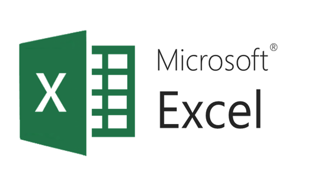

# Sales-Dashboard

## Overview : 
The Sales Dashboard is a comprehensive visualization tool designed to analyze sales performance across various categories, profit trends, state-wise sales distribution, and customer engagement from 2014 to 2017. This dashboard provides key insights to help inform strategic decisions aimed at enhancing sales and optimizing customer relations.

## Tool used :
&nbsp;

## Result and Insights :

## Data Story :
The sales dashboard paints a comprehensive picture of sales performance across categories and territories. It indicates strong sales in technology and furniture, steady increase in customer numbers, and identifies key customers contributing to profits. This information can be leveraged to further enhance sales strategies and improve profitability across all categories.

## Dashboard :
&nbsp;
